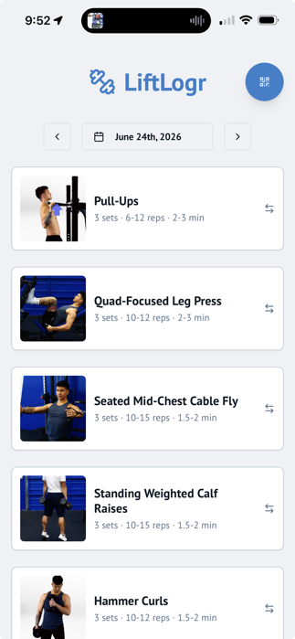

# workout-tracker (LiftLogr)

A mobile-first PWA for tracking strength workouts. Browse a routine, mark sets complete, log weight per exercise, watch a demo video, and review weight history. Installable to the home screen with offline support.



**Stack:** Next.js 16 (App Router) · React 18 · TypeScript · Tailwind · shadcn/ui · `@ducanh2912/next-pwa` · `date-fns`

## Why this is interesting

The project is small on purpose. The goal was a fast, tactile workout companion, not a CRUD app. The interesting work is in interaction: swipe gestures, a custom video player tuned for short-form exercise clips, and a PWA update flow that doesn't strand users on stale assets.

## File map

```
src/
├── app/
│   └── page.tsx              # Main workout view: state, history, completion flow
├── components/
│   ├── workout-card.tsx      # Per-exercise card with weight input, history dialog, video trigger
│   ├── video-player.tsx      # Custom <video> controls (play/pause/scrub)
│   └── pwa-updater.tsx       # Service worker update prompt
└── hooks/
    └── use-swipe.ts          # Tiny, dependency-free swipe-gesture hook
```

## Design notes

- **`use-swipe`** is intentionally tiny: refs for start coords, an axis-dominance check (so vertical scrolling isn't hijacked), and a configurable threshold. No event-listener cleanup needed because it returns handlers, not effects.
- **`workout-card`** keeps its own UI state for dialogs but lifts persistent progress (weight, completion) up to the page via callbacks, following the standard "controlled where it matters, local where it doesn't" pattern.
- **`video-player`** is a thin wrapper over the native `<video>` element with a custom transport. Loading state, play/pause, scrub via shadcn's `Slider`. No HLS, no DRM. The assets are short demos.
- **`pwa-updater`** subscribes to service-worker lifecycle events and surfaces a toast when a new version is ready. Avoids the classic "stuck on stale build" PWA failure mode.

## Not included in this sample

- The shadcn/ui primitives under `@/components/ui/*`
- The `workout-data.ts` exercise/routine seed file
- `next.config.ts`, PWA manifest, service worker config
- Layout/global CSS
